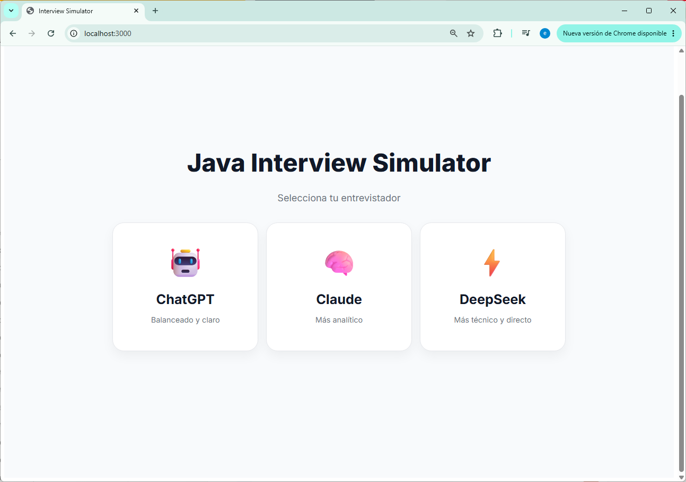
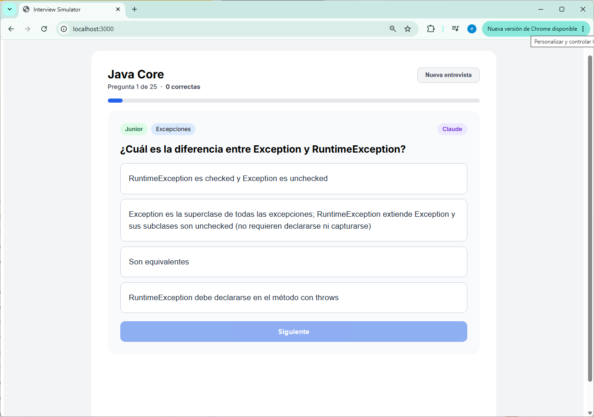

# 🎯 Java Interview Simulator

Aplicación web para practicar preguntas de entrevistas técnicas de Java, con bancos de preguntas generados por distintas IAs.

---

## 📸 Screenshots

### Selección de entrevistador


### Simulador en acción


---

## ✨ Características

- 🤖 **3 bancos de preguntas** generados por ChatGPT, Claude y DeepSeek
- 🔀 **Shuffle real** con algoritmo Fisher-Yates — preguntas distintas en cada sesión
- 🏷️ Preguntas etiquetadas por **nivel** (Junior / Mid) y **categoría**
- 💡 **Explicación detallada** al responder cada pregunta
- 📊 **Resultado final** con score y porcentaje

---

## 🚀 Cómo ejecutar

### Con Docker
```bash
docker-compose up
```
Abre [http://localhost:3000](http://localhost:3000)

### Sin Docker
```bash
npm install
npm run dev
```

---

## 🗂️ Estructura del proyecto

```
public/
  question-banks/
    java_core/
      chatgpt_java_core.json
      claude_java_core.json
      deepseek_java_core.json
src/
  App.jsx          # Lógica principal y navegación
  LandingPage.jsx  # Selección de entrevistador (AI)
  TopicPage.jsx    # Selección de tema
```

---

## 🛠️ Stack

- **React 18** + Vite
- **Docker** para desarrollo
- Vanilla CSS-in-JS (sin librerías de estilos)
