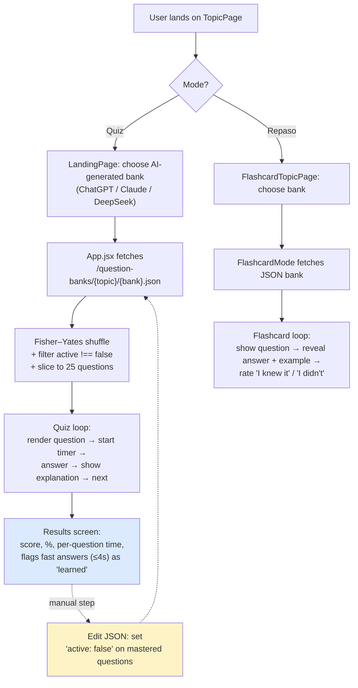
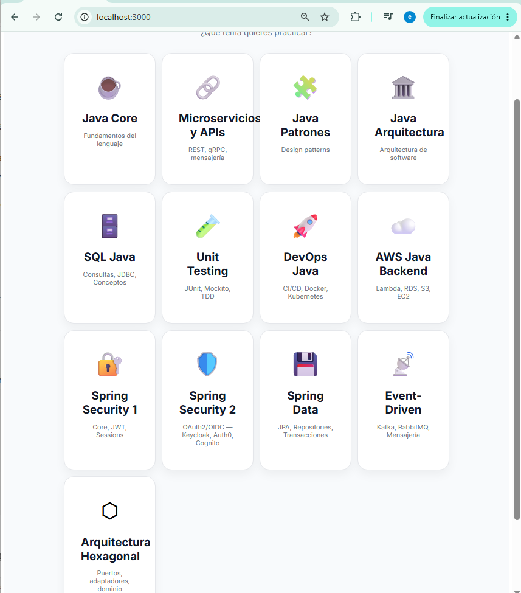
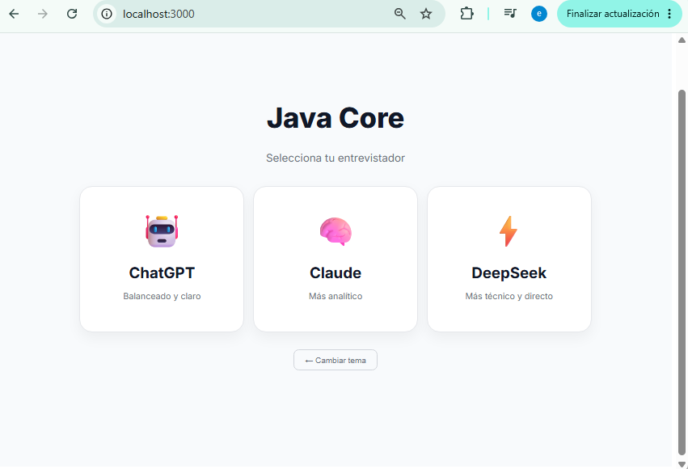

# 🎯 Backend Interview Simulator

An active-recall practice tool for Java backend interviews — quiz mode with scoring and timers, plus a spaced-repetition-style flashcard mode. Built to replace passive note review with deliberate practice across the topics a Java backend developer actually gets tested on: Core, Design Patterns, Architecture, Microservices, Spring Security, Spring Data, and Event-Driven systems.

Runs in the browser on **web and mobile** — no install, no native app, just a URL.

---

## The problem

Re-reading notes before a technical interview feels productive but isn't — it creates familiarity without recall. I needed a way to **actively test myself** across the full surface area of a Java backend role (not just "Java" — architecture, messaging, security, data access), track which questions I actually struggle with, and iterate on my weak spots instead of my strong ones, from my laptop or my phone.

---

## How it works (at a glance)


```mermaid
flowchart TD
    A["User lands on TopicPage"] --> B{Mode?}
    B -->|Quiz| C["LandingPage: choose AI-generated bank<br/>(ChatGPT / Claude / DeepSeek)"]
    B -->|Repaso| D["FlashcardTopicPage: choose bank"]

    C --> E["App.jsx fetches<br/>/question-banks/{topic}/{bank}.json"]
    D --> F["FlashcardMode fetches JSON bank"]

    E --> G["Fisher–Yates shuffle<br/>+ filter active !== false<br/>+ slice to 25 questions"]
    G --> H["Quiz loop:<br/>render question → start timer →<br/>answer → show explanation → next"]
    H --> I["Results screen:<br/>score, %, per-question time,<br/>flags fast answers (&le;4s) as 'learned'"]

    F --> J["Flashcard loop:<br/>show question → reveal answer + example →<br/>rate 'I knew it' / 'I didn't'"]

    I -.manual step.-> K["Edit JSON: set<br/>'active: false' on mastered questions"]
    K -.-> E

    style I fill:#dbeafe
    style K fill:#fef3c7
```

**Everything runs client-side, and nothing is persisted anywhere.** There's no backend and no `localStorage` — question banks are static JSON fetched from `/public/question-banks/{topic}/{bank}.json`, and all session state (score, current question, timers, screen) lives in plain React state. Close the tab and it's gone. That's a deliberate current limitation, not an oversight — see [What's missing](#whats-missing--next-steps).

App navigation (current screen, score, timers) is driven by a hand-rolled screen-based state machine in `App.jsx` — no `react-router`, since there's nothing that needs to be a real URL yet.

---

## Screenshots

**Choosing an "interviewer" (AI-generated question bank) for a topic:**


**Full topic catalog — Java Core through Event-Driven and Hexagonal Architecture:**


---

## Stack

- **React 18** + **Vite** — fast dev loop, no framework overhead for what is fundamentally a state machine over JSON.
- **Docker / docker-compose** — bind-mounted dev container so edits sync instantly between host and container (`volumes: .:/app`), used mainly to keep the environment identical across machines.
- **Vanilla CSS-in-JS** (inline style objects, no Tailwind/styled-components) — deliberate, see below.
- **Static JSON as the data layer** — no database, no ORM, no API calls of any kind today.
- **Responsive layout** — `clamp()`-based sizing throughout, so the same codebase works as a mobile web app without a separate build.

---

## Technical decisions — and why

**Why JSON files instead of a database.**
This project's actual bottleneck isn't data modeling, it's *content* — writing and curating good interview questions. A database, migrations, and an API layer would have been pure overhead for a single-user study tool with a few hundred static records. `fetch('/question-banks/...')` gives me versioned, diffable, human-editable content for free. The tradeoff is explicit and known: **no persistence and no server-side writes**, which is why "mark as mastered" is a manual JSON edit today rather than a button — see [What's missing](#whats-missing--next-steps).

**Why question banks are generated by multiple AIs (ChatGPT, Claude, DeepSeek) instead of one.**
A single model can be confidently wrong, especially on nuanced architecture questions. Generating the same topic through three different models and comparing their answers and explanations gave me a cheap cross-validation signal — where they agree, I trust the explanation more; where they diverge, that's exactly the kind of question worth researching properly instead of memorizing blindly. It also meant more varied phrasing per topic instead of one model's recurring patterns. Newer topics use a single Claude-only bank because by that point I'd converged on the format and quality bar I wanted, and tripling the authoring effort stopped paying for itself.

**Why a hand-rolled screen state machine instead of `react-router`.**
There are no shareable URLs, no deep-linking requirement, and no SEO concern — it's a single-session practice tool. Introducing a router would add a dependency and a mental model (routes, params, history) to solve a problem I don't have: `screen ∈ {topic, landing, quiz, flashcard_topic, flashcard}` is a plain `useState` value driven entirely by user choices in-session.

**Why manual `active: false` flagging instead of a progress-tracking UI.**
While actively studying, I wanted the lowest-friction way to stop seeing questions I've mastered: open the JSON, flip a flag, done. Building a full progress-tracking UI before I even knew what "mastery" should mean in this app would have been solving an assumed problem. The results screen already computes which questions were answered in ≤4 seconds and surfaces them as candidates — I decide, I flag, I move on. It's a conscious "manual now, automated later" tradeoff — see the backend plan below.

**Why the Fisher–Yates shuffle runs on both options and question order.**
Multiple-choice questions are easy to memorize by *position* ("the answer is always C") rather than by actually knowing the material. Shuffling both the question order and the option order per session forces recall instead of pattern-matching the quiz UI itself.

**Why `useEffect`/`useMemo` are hoisted above every conditional return in `App.jsx`.**
This one cost me a blank-screen bug more than once early on — React's Rules of Hooks mean a hook call skipped on some renders (because it sat after an `if (loading) return ...`) breaks hook ordering on the next render. It's now a fixed convention across every component in this project.

---

## Running it locally

**With Docker (recommended, matches dev environment exactly):**
```bash
docker-compose up
```
Open [http://localhost:3000](http://localhost:3000)

**Without Docker:**
```bash
npm install
npm run dev -- --host
```

## Deployed version

Live at **[interview-simulator-ecru.vercel.app](https://interview-simulator-ecru.vercel.app)**.

Deployed on **Vercel**, connected directly to the GitHub repo — every push to `main` triggers an automatic build and deploy, so changes show up on my phone within seconds with zero manual steps. This was effectively free given the stack: a static Vite build has no server-side runtime to configure, so connecting the repo was the entire deployment process.

---

## Project structure

```
public/
  question-banks/
    java_core/
      chatgpt_java_core.json
      claude_java_core.json
      deepseek_java_core.json
    java_patrones/
    java_arquitectura/
    microservicios/
    spring_security_1/      # Core, JWT, Sessions
    spring_security_2/      # OAuth2/OIDC — Keycloak, Auth0, Cognito
    spring_data/
    event_driven/           # Kafka, RabbitMQ
src/
  App.jsx                # Screen state machine, quiz engine, timers, shuffle
  LandingPage.jsx         # AI bank selection per topic
  TopicPage.jsx           # Topic selection (quiz mode)
  FlashcardTopicPage.jsx  # Topic selection (repaso mode)
  FlashcardMode.jsx       # Flashcard review loop
```

---

## What's missing / next steps

This is an actively evolving project, and I'm treating these as deliberate next iterations — there's real room to grow on both the backend and the frontend:

- **A real backend.** Today the app makes zero API calls; everything is static JSON served alongside the frontend. The next major milestone is introducing a backend (Spring Boot, fittingly) to move past the "static SPA" ceiling.
- **User registration and accounts.** Letting people log in is the prerequisite for everything below — without an identity, there's no "your" history to track.
- **Persisted progress and learning stats.** Replace manual `active: false` JSON editing with a real `user_question_progress` table (`user_id`, `question_id`, `bank_id`, `status`, `avg_time`), and surface it as actual analytics: accuracy and speed trends per topic over time, not just a single session's results screen.
- **A real question-authoring pipeline** instead of hand-editing JSON — schema validation (`id`, `options`, `correct` index bounds) before a malformed bank silently breaks the shuffle logic.
- **PWA packaging** — the UI already works well on mobile browsers; making it installable (offline caching, home-screen icon) is a small step from here given there's no backend dependency yet.

---

## Why this project, technically

This isn't meant to demonstrate a complex distributed system — it's meant to show that I make deliberate scope decisions: I know when a database is overkill, when a router is unnecessary complexity, and when "manual for now" is the right call versus a shortcut I plan to forget about. The pending question banks and the roadmap above are the actual current TODO list, not aspirational filler.
